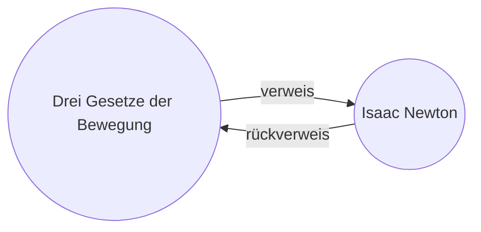

Mit der Erweiterung `Rückverweis` können Sie alle _Rückverweise_ (in Englisch _Backlinks_) für die aktive Notiz sehen.

Ein Rückverweis für eine Notiz ist ein Link von einer anderen Notiz zu dieser Notiz. Im folgenden Beispiel enthält die Notiz "Drei Gesetze der Bewegung" einen Link auf die Notiz "Isaac Newton". Der entsprechende Rückverweis würde von "Isaac Newton" zurück zu "Drei Gesetze der Bewegung" führen.

Rückverweise können nützlich sein, um Notizen zu finden, die auf die Notiz verweisen, die Sie gerade schreiben. Stellen Sie sich vor, Sie könnten die Rückverweise für jede Website im Internet auflisten!

## Der Rückverweis-Bereich

Im Bereich _Rückverweis_ können Sie alle Rückverweise für die aktive Notiz sehen. Der Rückverweis-Bereich hat zwei ausklappbare Abschnitte: **Verlinkte Erwähnungen** und **Unverlinkte Erwähnungen**.

- **Verknüpfte Erwähnungen** sind Rückverweise zu den Notizen, die einen internen Link zur aktiven Notiz enthalten. 
- **Unverknüpfte Erwähnungen** sind Rückverweise zu allen unverknüpften Vorkommen des Namens der aktiven Notiz.

Der Bereich Rückverweise bietet die folgenden Optionen:

- **Ergebnisse zuklappen** schaltet um, ob jede Notiz erweitert werden soll, um die darin enthaltenen Erwähnungen anzuzeigen. 
- **Mehr Kontext anzeigen** schaltet um, ob der gesamte Absatz, der die Erwähnung enthält, abgeschnitten oder angezeigt werden soll. 
- **Sortierreihenfolge ändern** legt fest, wie die Erwähnungen sortiert werden sollen. 
- **Suchfilter anzeigen** schaltet ein Textfeld ein, mit dem Sie die Erwähnungen filtern können. Weitere Informationen zur Erstellung einer Suchanfrage finden Sie unter [[Suche]].

> [!tip]
> Wenn Sie Rückverweise für mehrere Notizen gleichzeitig sehen möchten, können Sie **Rückverweise in Notitz** unter den Plugin-Optionen aktivieren, um Rückverweise im gleichen Fenster wie Ihre Notiz anzuzeigen.

## Rückverweise für eine Notiz anzeigen

Um die Rückverweise für die aktive Notiz anzuzeigen, klicken Sie auf die Registerkarte **Rückverweise** (Link und Pfeilsymbol) in der rechten Seitenleiste.

> [!note] Notitz
> Wenn Sie die Registerkarte Rückverweise nicht sehen können, können Sie sie sichtbar machen, indem Sie die Befehlspalette öffnen und den Befehl Rückverweis: Rückverweis-Bereich anzeigen.
