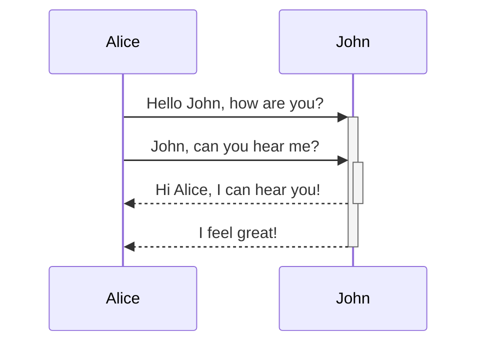
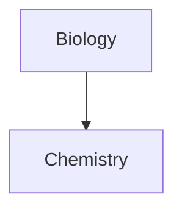

Obsidian ist eine Markdown-basierte App für Notizen und Wissensdatenbanken.

Wir unterstützen derzeit die folgenden Formate:

---

### Internes verlinken

```md
Link zu einer Seite: [[Interner Link]].
```


Link zu einer Seite: [[Interner Link]].

---

### Einbetten

Eine andere Datei einbetten (lesen Sie mehr über [[Dateien einbetten]]). Hier ist ein eingebetteter Abschnitt:

```md
![[Obsidian#Was ist Obsidian?]]
```
![[Obsidian#Was ist Obsidian?]]

---

### Überschriften

```md
# Das ist eine Überschrift 1
## Das ist eine Überschrift 2
### Das ist eine Überschrift 3
#### Das ist eine Überschrift 4
##### Das ist eine Überschrift 5
###### Das ist eine Überschrift 6
```

%% Diese Überschriften verwenden HTML, um die Gliederung/das Inhaltsverzeichnis nicht zu überladen%%
<h1>Das ist eine Überschrift 1</h1>
<h2>Das ist eine Überschrift 2</h2>
<h3>Das ist eine Überschrift 3</h3> 
<h4>Das ist eine Überschrift 4</h4>
<h5>Das ist eine Überschrift 5</h5>
<h6>Das ist eine Überschrift 6</h6>

---

Sie können auch die alternative Syntax für Überschrift 1 und Überschrift 2 verwenden.
```md
Überschrift 1
===

Überschrift 2
---
```


<h1>Überschrift 1</h1>

<h2>Überschrift 2</h2>

---

### Hervorhebung

```md
*Dieser Text ist kursiv*

_Dieser Text ist auch ist kursiv_
```

*Dieser Text ist kursiv*

_Dieser Text ist auch ist kursiv_

```md
**Dieser Text ist fett**

__Dieser Text ist auch ist fett__

```

**Dieser Text ist fett**

__Dieser Text ist auch ist fett__

```md
_Das **kann** auch kombiniert werden_
```

_Das **kann** auch kombiniert werden_

---

### Listen

#### Unnummerierte Listen

```md
- Element 1
- Element 2
  - Element 2a
  - Element 2b
```

- Element 1
- Element 2
  - Element 2a
  - Element 2b

#### Nummerierte Listen

```md
1. Element 1
1. Element 2
1. Element 3
  1. Element 3a
  1. Element 3b
```

1. Element 1
1. Element 2
1. Element 3
	1. Element 3a
	1. Element 3b

---

Erstellen Sie eine _lose Liste_, indem Sie eine Leerzeile zwischen zwei beliebigen Listeneinträgen einfügen.

```md
- Element 1

- Element 2
- Element 3
```

Will look like this:
- Element 1

- Element 2
- Element 3

---

### Bilder

```md

```


```md
![[og-image.png]]
```

![[og-image.png]]

#### Bildergrösse ändern

Beispiel für das obige Bild, das auf 100 Pixel Breite verkleinert wurde:

```md

```


oder für lokale Bilder
```md
![[og-image.png|200]]
```

![[og-image.png|200]]

---

### Links

#### Externe Links

Links im Markdown-Stil können verwendet werden, um entweder auf externe Objekte wie Webseiten oder auf eine interne Seite oder ein Bild zu verweisen.

```md http://obsidian.md - automatisch! [Obsidian](http://obsidian.md) ```

#### Obsidian URI Links

[[Verwendung von Obsidian URI|Obsidian URI]]-Links können verwendet werden, um Notizen in Obsidian zu öffnen, entweder von einem anderen Obsidian-Tresor oder einem anderen Programm.

Zum Beispiel können Sie eine Datei in einem Tresor wie folgt verlinken (bitte beachten Sie die [[Obsidian-URI verwenden#Kodierung|erforderliche Kodierung]]):

```md
[Link zur Notitz](obsidian://open?path=D:%2Fpath%2Fto%2Ffile.md)
```

[Link zur  Notitz](obsidian://open?path=D:%2Fpath%2Fto%2Ffile.md)

Sie können eine Verknüpfung zu einer Notiz auch über den Namen des Tresors und den Dateinamen statt über den Pfad herstellen:

```md
[Link zur Notitz](obsidian://open?vault=MainVault&file=MyNote.md)
```

[Link zur Notitz](obsidian://open?vault=MainVault&file=MyNote.md)

#### Sonderzeichen umgehen

Wenn die URL Leerzeichen enthält, müssen diese durch "%20" ersetzt werden.

```md
[Exportieroptionen](Pasted%20image)
```

[Exportieroptionen](Pasted%20image)

Oder Sie können das Ziel in `<>` einschließen, wie z.B.:

```md
[Folien Demo](<Slides Demo>)
```

[Folien Demo](<Slides Demo>)

---

### Blockquotes

```md
> Human beings face ever more complex and urgent problems, and their effectiveness in dealing with these problems is a matter that is critical to the stability and continued progress of society.

\- Doug Engelbart, 1961
```

> Human beings face ever more complex and urgent problems, and their effectiveness in dealing with these problems is a matter that is critical to the stability and continued progress of society.

\- Doug Engelbart, 1961

---

### Code

#### Inline code

```md
Text inside `backticks` on a line will be formatted like code.
```

Text inside `backticks` on a line will be formatted like code. 


#### Code blocks

You can add syntax highlighting to a code block by adding a language code after the first set of backticks.

Obsidian uses Prism for syntax highlighting. For more information, refer to [Supported languages](https://prismjs.com/#supported-languages).

> [!note]
> [[Live preview update|Live Preview mode]] doesn't support PrismJS and may render syntax highlighting differently.

~~~md
```js
function fancyAlert(arg) {
  if(arg) {
    $.facebox({div:'#foo'})
  }
}
```
~~~


```js
function fancyAlert(arg) {
  if(arg) {
    $.facebox({div:'#foo'})
  }
}
```

---

```md
    Text indented with a tab is formatted like this, and will also look like a code block in preview. 
```

    Text indented with a tab is formatted like this, and will also look like a code block in preview. 

---

### Task list

```md
- [x] #tags, [links](), **formatting** supported
- [x] list syntax required (any unordered or ordered list supported)
- [x] this is a complete item
- [?] this is also a complete item (works with every character)
- [ ] this is an incomplete item
- [ ] tasks can be clicked in Preview to be checked off
```

- [x] #tags, [links](), **formatting** supported
- [x] list syntax required (any unordered or ordered list supported)
- [x] this is a complete item
- [?] this is also a complete item (works with every character)
- [ ] this is an incomplete item
- [ ] tasks can be clicked in Preview to be checked off

---

### Tables

You can create tables by assembling a list of words and dividing the header from the content with hyphens, `-`, and then separating each column with a pipe `|`:

```md
|First Header | Second Header|
|------------ | -----‐------|
|Content from cell 1 | Content from cell 2|
|Content in the first column | Content in the second column|
```

|First Header | Second Header|
|------------ | ------------|
|Content from cell 1 | Content from cell 2|
|Content in the first column | Content in the second column|

The vertical bars at the start and end of a line are optional.

```md
First Header | Second Header
------------ | ------------
Content from cell 1 | Content from cell 2
Content in the first column | Content in the second column
```

This results in the same table as the one above.

---

```md
Tables can be justified with a colon | Another example with a long title | And another long title as a example
:----------------|-------------:|:-------------:
because of the `:` | these will be justified |this is centered
```

Tables can be justified with a colon | Another example with a long title | And another long title as a example
:----------------|-------------:|:-------------:
because of the `:` | these will be justified |this is centered

If you put links in tables, they will work, but if you use [[Add aliases to note|aliases]], the pipe must be escaped with a `\` to prevent it being read as a table element.

```md
First Header | Second Header
------------ | ------------
[[Format your notes\|Formatting]]	|  [[Keyboard shortcuts\|hotkeys]]
```

First Header | Second Header
------------ | ------------
[[Format your notes\|Formatting]]	|  [[Use hotkeys\|hotkeys]]	

---

### Strikethrough

```md
Any word wrapped with two tildes (like ~~this~~) will appear crossed out.
```

Any word wrapped with two tildes (like ~~this~~) will appear crossed out.

---

### Highlighting

```md
Use two equal signs to ==highlight text==.
```

Use two equal signs to ==highlight text==.

---

### Horizontal Bar

Use three stars ***, hyphens ---, or underscores ___ in a new line to produce an horizontal bar.


***

---

### Footnotes

```md
Here's a simple footnote,[^1] and here's a longer one.[^bignote]

[^1]: meaningful!

[^bignote]: Here's one with multiple paragraphs and code.

    Indent paragraphs to include them in the footnote.

    `{ my code }`

    Add as many paragraphs as you like.
```

Here's a simple footnote,[^1] and here's a longer one.[^bignote]

[^1]: meaningful!

[^bignote]: Here's one with multiple paragraphs and code.

    Indent paragraphs to include them in the footnote.

    `{ my code }`

    Add as many paragraphs as you like.

---

```md
You can also use inline footnotes. ^[notice that the caret goes outside of the brackets on this one.]
```

You can also use inline footnotes. ^[notice that the caret goes outside of the brackets on this one.]

---

### Math

```md
$$\begin{vmatrix}a & b\\
c & d
\end{vmatrix}=ad-bc$$
```

$$\begin{vmatrix}a & b\\
c & d
\end{vmatrix}=ad-bc$$

---

```md
You can also do inline math like $e^{2i\pi} = 1$ .
```

You can also do inline math like $e^{2i\pi} = 1$ .

To render math from LaTeX notation Obsidian uses [MathJax](http://docs.mathjax.org/en/latest/basic/mathjax.html).
For more information about the syntax, refer to [MathJax basic tutorial and quick reference](https://math.meta.stackexchange.com/questions/5020/mathjax-basic-tutorial-and-quick-reference).

For a list of supported MathJax packages, refer to [The TeX/LaTeX Extension List](http://docs.mathjax.org/en/latest/input/tex/extensions/index.html).

---

### Comments

Use `%%` to enclose comments, which will be parsed as Markdown, but will not show up in the preview.

```md
Here is some inline comments: %%You can't see this text%% (Can't see it in Reading mode)

Here is a block comment:
%%
It can span
multiple lines
%%
```

Here is some inline comments: %%You can't see this text%% (can't see it in Reading mode)

Here is a block comment: (can't see it in Reading mode either)
%%
It can span
multiple lines
%%

---

### Callouts

Use the following syntax to denote a callout block: `> [!INFO]`.

Learn more about callouts [[Use callouts|here]].

```markdown
> [!INFO]
> Here's a callout block.
> It supports **markdown** and [[Internal link|wikilinks]].
```

> [!INFO]
> Here's a callout block.
> It supports **markdown** and [[Internal link|wikilinks]].

---

### Diagram

Obsidian uses [Mermaid](https://mermaid-js.github.io/) to render diagrams and charts. Mermaid also provides [a helpful live editor](https://mermaid-js.github.io/mermaid-live-editor).
Mermaid provides the following diagram types:
- Flowchart
- Sequence diagram
- Class Diagram
- State Diagram
- Entity Relationship Diagram
- User Journey
- Gantt
- Pie Chart
- Requirement Diagram

````md

````


````md

````


Obsidian supports linking to notes in Mermaid,
these links will not show up on [[Graph view]].
````md

````


An easier way to do it is the following: ^376b9d
````md

````

This way, all the note names (at least until `Z[note name]`) are all automatically assigned the class `internal-link` when you use this snippet.

If you use special characters in your note names, you need to put the note name in double quotes.
`"⨳ special character"`
It looks like this if you follow the [[Format your notes#^376b9d|second option]]:
`A["⨳ special character"]`

---

## Developer notes

We strive for maximum capability without breaking any existing formats, therefore we use a slightly unorthodox combination of flavors of markdown. It is broadly CommonMark, with the addition of some functionality from GitHub Flavored Markdown (GFM), some LaTeX support, and our chosen embed syntax, which you can read more about at [[Accepted file formats]].

We intentionally do not support parsing markdown syntax and blank lines within HTML blocks. This is the result of an optimization to handle very large files and to support synchronization between editing and reading mode.
